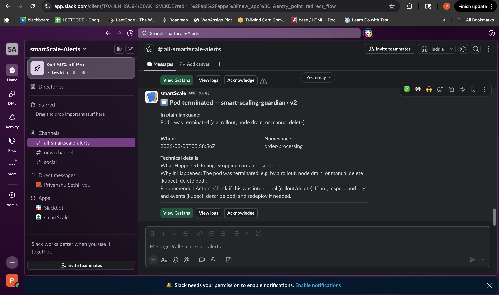

# Smart-Scaling Guardian

> An AI-powered Kubernetes autoscaling monitor built on AWS EKS — provisioned with Terraform, watched by a custom Python Sentinel agent, and alerting on-call engineers via Gemini-generated Slack notifications.

---

## Table of Contents

- [Overview](#overview)
- [Demo](#demo)
- [Features](#features)
- [Architecture](#architecture)
- [Project Structure](#project-structure)
- [Prerequisites](#prerequisites)
- [Getting Started](#getting-started)
  - [1. Provision infrastructure with Terraform](#1-provision-infrastructure-with-terraform)
  - [2. Build and push container images](#2-build-and-push-container-images)
  - [3. Deploy Kubernetes workloads](#3-deploy-kubernetes-workloads)
  - [4. Deploy the Sentinel agent](#4-deploy-the-sentinel-agent)
  - [5. Run the load test](#5-run-the-load-test)
- [Configuration](#configuration)
- [Slack Alert Format](#slack-alert-format)
- [Tech Stack](#tech-stack)

---

## Overview

Smart-Scaling Guardian is a production-grade DevOps project that demonstrates:

- **Infrastructure as Code** — a full AWS EKS cluster created from scratch with Terraform, zero console clicks.
- **Containerised microservice** — a Go order-processing API with Prometheus metrics built in.
- **Horizontal Pod Autoscaling** — the Kubernetes HPA automatically scales the service based on CPU utilisation under real load.
- **AI-powered observability** — a Python Sentinel agent runs inside the cluster, watches the Kubernetes event stream, calls **Google Gemini 1.5 Flash** to generate an incident summary, and posts an enriched **Slack Block Kit** card to the on-call channel in seconds.

---

## Demo

### Slack alert

> _Add a screenshot of the Slack alert card here._
> _Tip: paste a screenshot of the Slack card with the "In plain language", "Technical details", and action buttons visible._

<!-- Replace the line below with your image -->


### Live terminal output

> _Add a screenshot or GIF of the terminal running the demo here._

<!-- Replace the line below with your image -->


---

## Features

| Feature | Detail |
|---|---|
| **Terraform-provisioned EKS** | VPC, subnets, IAM roles, node groups — fully codified in reusable modules |
| **Go order-processing service** | `POST /orders`, `GET /health`, `GET /metrics` — stateless, Prometheus-instrumented |
| **Kubernetes HPA** | Scales 1 → 10 replicas based on CPU (target 50%) with a cooldown window |
| **Sentinel event watcher** | Python agent reading the K8s event stream for `Killing`, `OOMKilling`, `BackOff`, `Failed`, `Unhealthy` |
| **Gemini AI summaries** | Each alert includes a three-section AI breakdown: _What Happened_, _Why It Happened_, _Recommended Action_ |
| **Descriptive fallback** | When Gemini is unavailable, a full technical summary is generated locally — never "AI unavailable" |
| **Smart deduplication** | Events are deduplicated by UID + resourceVersion with a configurable TTL; repeat K8s count updates are suppressed |
| **Slack Block Kit cards** | Rich, structured cards with colour-coded headers, plain-language summary, technical detail, and action buttons |
| **Noise filter** | `ALERT_REASONS` env var lets you include/exclude specific event types without redeploying |
| **k6 load test** | Realistic ramp-up/steady/ramp-down traffic to exercise the HPA and validate scaling behaviour |

---

## Architecture

```
┌─────────────────────────────────────────────────────────────┐
│                        AWS (us-east-2)                      │
│                                                             │
│   ┌──────────────────────────────────────────────────────┐  │
│   │              VPC  10.0.0.0/16                        │  │
│   │                                                      │  │
│   │   ┌──────────────── EKS Cluster ─────────────────┐  │  │
│   │   │   namespace: order-processing                 │  │  │
│   │   │                                               │  │  │
│   │   │  ┌─────────────────────┐  ┌───────────────┐  │  │  │
│   │   │  │   order-service     │  │   Sentinel    │  │  │  │
│   │   │  │   (Go)  :8080       │  │   (Python)    │  │  │  │
│   │   │  │  /orders            │  │               │  │  │  │
│   │   │  │  /health            │  │  K8s Event ──►│  │  │  │
│   │   │  │  /metrics           │  │  Stream       │  │  │  │
│   │   │  └────────┬────────────┘  └──────┬────────┘  │  │  │
│   │   │           │                      │            │  │  │
│   │   │  ┌────────▼──────────────────────▼────────┐  │  │  │
│   │   │  │          HPA (1–10 replicas)            │  │  │  │
│   │   │  │     CPU target: 50% / Memory: 70%       │  │  │  │
│   │   │  └─────────────────────────────────────────┘  │  │  │
│   │   └───────────────────────────────────────────────┘  │  │
│   │                         │                            │  │
│   │            AWS LoadBalancer (ELB)                    │  │
│   └──────────────────────────────────────────────────────┘  │
└─────────────────────────────────────────────────────────────┘
         │                              │
    k6 load test                  Gemini 1.5 Flash
    (local machine)               (Google AI API)
                                        │
                                  Slack Webhook
                                  (on-call channel)
```

### Alert pipeline

```
K8s event stream
      │
      ▼
Sentinel watches for: Killing · OOMKilling · BackOff · Failed · Unhealthy
      │
      ├─► Skip if: Sentinel's own pods │ event.count > 1 (dedup) │ not in ALERT_REASONS
      │
      ▼
Collect context: deployment status · HPA metrics · pod logs · replica delta
      │
      ▼
Call Gemini 1.5 Flash (timeout 15s, 3 retries)
      │
      ├─ Success ──► validate 3-section response → extract plain-language sentence
      │
      └─ Failure ──► build local technical fallback (What / Why / Action)
      │
      ▼
Build Slack Block Kit payload
      │
      ▼
POST to Slack webhook → alert in on-call channel
```

---

## Project Structure

```
smart-scaling-guardian/
├── terraform/                  # Phase 1 — AWS infrastructure
│   ├── main.tf                 # Root module wiring VPC + EKS + node group
│   ├── variables.tf
│   ├── outputs.tf
│   ├── backend.tf              # S3 remote state
│   └── modules/
│       ├── vpc/                # VPC, subnets, IGW, NAT
│       ├── eks-cluster/        # EKS control plane + OIDC
│       └── node-group/         # Managed node group + IAM
│
├── app/                        # Phase 2 — Go order-processing service
│   ├── main.go                 # HTTP server: /orders, /health, /metrics
│   ├── go.mod
│   └── Dockerfile              # Multi-stage build, linux/amd64
│
├── k8s/                        # Phase 3 — Kubernetes manifests
│   ├── namespace.yaml
│   ├── deployment.yaml         # order-service deployment
│   ├── service.yaml            # LoadBalancer service
│   ├── hpa.yaml                # HPA (min 1, max 10, CPU 50%)
│   ├── configmap.yaml
│   ├── secret.yaml.example     # Template — never commit secret.yaml
│   ├── rbac.yaml               # Sentinel ServiceAccount + ClusterRole
│   └── sentinel-deployment.yaml
│
├── sentinel/                   # Phase 4 — AI observability agent
│   ├── sentinel.py             # Entry point — K8s watch loop
│   ├── event_handler.py        # Event processing, context collection, AI call
│   ├── gemini_client.py        # Gemini API client with retry + validation
│   ├── slack_notifier.py       # Block Kit card builder + webhook POST
│   ├── dedup_cache.py          # In-memory deduplication cache
│   ├── requirements.txt
│   ├── Dockerfile
│   └── prompts/
│       └── sentinel_prompt.txt # Prompt template sent to Gemini
│
├── load-test/                  # Phase 5 — k6 load testing
│   ├── k6_script.js            # Ramp-up / steady / ramp-down scenario
│   └── README.md
│
├── scripts/
│   ├── rollout-sentinel.sh     # Safe Sentinel redeploy (handles capacity)
│   ├── demo-script.sh          # Sequenced demo workflow
│   └── record-demo.sh          # Run demo + save output as README.md
│
├── .env.example                # Local env template
└── README.md
```

---

## Prerequisites

| Tool | Version | Purpose |
|---|---|---|
| [Terraform](https://developer.hashicorp.com/terraform/install) | >= 1.5 | Provision AWS infrastructure |
| [AWS CLI](https://docs.aws.amazon.com/cli/latest/userguide/install-cliv2.html) | >= 2.x | Authenticate + configure kubeconfig |
| [kubectl](https://kubernetes.io/docs/tasks/tools/) | >= 1.29 | Manage Kubernetes resources |
| [Docker](https://docs.docker.com/get-docker/) | >= 24 | Build and push container images |
| [Helm](https://helm.sh/docs/intro/install/) | >= 3.x | (Optional) install cluster add-ons |
| [k6](https://grafana.com/docs/k6/latest/get-started/installation/) | >= 0.50 | Run load tests |

You also need:
- An **AWS account** with permissions to create EKS, VPC, IAM, ECR, and EC2 resources.
- A **Google Gemini API key** — [get one free at Google AI Studio](https://aistudio.google.com/app/apikey).
- A **Slack incoming webhook URL** — [create one here](https://api.slack.com/messaging/webhooks).

---

## Getting Started

### 1. Provision infrastructure with Terraform

```bash
cd terraform

# Copy and fill in your values
cp terraform.tfvars.example terraform.tfvars

# Initialise (configure S3 backend in backend.tf first, or remove it to use local state)
terraform init

# Preview
terraform plan

# Apply (~10–15 minutes for EKS)
terraform apply
```

Configure `kubectl` after apply:

```bash
aws eks update-kubeconfig \
  --region us-east-2 \
  --name smart-scaling-guardian
```

Verify:

```bash
kubectl get nodes
```

---

### 2. Build and push container images

Log in to ECR first:

```bash
AWS_ACCOUNT_ID=$(aws sts get-caller-identity --query Account --output text)
aws ecr get-login-password --region us-east-2 | \
  docker login --username AWS --password-stdin \
  ${AWS_ACCOUNT_ID}.dkr.ecr.us-east-2.amazonaws.com
```

**Order service:**

```bash
# Create the ECR repository (first time only)
aws ecr create-repository --repository-name order-service --region us-east-2

# Build for linux/amd64 (required on Apple Silicon)
docker build --platform linux/amd64 \
  -t ${AWS_ACCOUNT_ID}.dkr.ecr.us-east-2.amazonaws.com/order-service:v1.0.0 \
  ./app

docker push ${AWS_ACCOUNT_ID}.dkr.ecr.us-east-2.amazonaws.com/order-service:v1.0.0
```

**Sentinel:**

```bash
# Create the ECR repository (first time only)
aws ecr create-repository --repository-name sentinel --region us-east-2

docker build --platform linux/amd64 \
  -t ${AWS_ACCOUNT_ID}.dkr.ecr.us-east-2.amazonaws.com/sentinel:v1.0.4 \
  ./sentinel

docker push ${AWS_ACCOUNT_ID}.dkr.ecr.us-east-2.amazonaws.com/sentinel:v1.0.4
```

Update the image URIs in `k8s/deployment.yaml` and `k8s/sentinel-deployment.yaml` to match.

---

### 3. Deploy Kubernetes workloads

**Create the secrets file:**

```bash
cd k8s
cp secret.yaml.example secret.yaml
# Edit secret.yaml: add base64-encoded GEMINI_API_KEY and SLACK_WEBHOOK_URL
# echo -n "your-key" | base64
```

**Apply manifests in order:**

```bash
kubectl apply -f namespace.yaml
kubectl apply -f configmap.yaml
kubectl apply -f secret.yaml
kubectl apply -f rbac.yaml
kubectl apply -f deployment.yaml
kubectl apply -f service.yaml
kubectl apply -f hpa.yaml
```

**Verify:**

```bash
kubectl get deploy,svc,hpa -n order-processing
kubectl get pods -n order-processing -w
```

**Get the LoadBalancer URL:**

```bash
kubectl get svc order-service -n order-processing
# Use the EXTERNAL-IP value
curl http://<EXTERNAL-IP>/health
```

---

### 4. Deploy the Sentinel agent

```bash
kubectl apply -f k8s/sentinel-deployment.yaml
kubectl get pods -n order-processing -l app=sentinel -w
```

To safely redeploy Sentinel after any code/image change (handles t3.micro capacity limits):

```bash
./scripts/rollout-sentinel.sh
```

Verify Sentinel is watching events:

```bash
kubectl logs -n order-processing -l app=sentinel --tail=30 -f
```

**Trigger a test alert** (delete one pod so Sentinel fires a `Killing` event to Slack):

```bash
kubectl get pods -n order-processing -l app=order-service -o name \
  | head -1 | xargs kubectl delete -n order-processing
```

You should see a Slack card arrive within ~10 seconds.

---

### 5. Run the load test

Install k6 (macOS):

```bash
brew install k6
```

Set your LoadBalancer URL and run:

```bash
export LB=<EXTERNAL-IP>
k6 run -e BASE_URL="http://$LB" load-test/k6_script.js
```

Watch the HPA scale in a second terminal:

```bash
kubectl get hpa order-service-hpa -n order-processing -w
kubectl get pods -n order-processing -w
```

---

## Configuration

### Terraform (`terraform/terraform.tfvars`)

| Variable | Default | Description |
|---|---|---|
| `aws_region` | `us-east-2` | AWS region |
| `cluster_name` | `smart-scaling-guardian` | EKS cluster name |
| `kubernetes_version` | `1.29` | Kubernetes version |
| `node_instance_type` | `t3.micro` | Worker node instance type |
| `node_min_count` | `2` | Minimum nodes |
| `node_max_count` | `10` | Maximum nodes |
| `node_desired_count` | `2` | Initial node count |

### Sentinel (`k8s/sentinel-deployment.yaml` env vars)

| Variable | Default | Description |
|---|---|---|
| `ALERT_REASONS` | `OOMKilling,BackOff,Failed,Unhealthy,Killing` | Comma-separated event reasons to alert on |
| `GEMINI_MODEL` | `gemini-1.5-flash` | Gemini model to use |
| `GEMINI_TIMEOUT_SECONDS` | `15` | Timeout per Gemini call |
| `DEDUP_CACHE_TTL_SECONDS` | `300` | Dedup window (5 min) |
| `GRAFANA_DASHBOARD_URL` | — | URL for the "View Grafana" button in Slack |
| `LOG_LEVEL` | `INFO` | Log verbosity |

---

## Slack Alert Format

Each alert card contains:

```
┌─────────────────────────────────────────────────────┐
│  ⏹ Pod terminated — smart-scaling-guardian · v2     │  ← header (colour-coded by event type)
├─────────────────────────────────────────────────────┤
│  In plain language:                                 │
│  Pod 'order-service-xxx' was terminated             │  ← non-technical summary
│  (rollout, drain, or manual delete).                │
├─────────────────────────────────────────────────────┤
│  When: 2026-03-05T05:27:24Z    Namespace: order-... │
├─────────────────────────────────────────────────────┤
│  Technical details                                  │
│  What Happened: ...                                 │  ← Gemini AI (or local fallback)
│  Why It Happened: ...                               │
│  Recommended Action: ...                            │
├─────────────────────────────────────────────────────┤
│  [View Grafana]  [View logs]  [Acknowledge]         │  ← action buttons
└─────────────────────────────────────────────────────┘
```

Event type → card colour:

| Event | Colour | Icon |
|---|---|---|
| Scaling up | Green | 📈 |
| Scaling down | Blue | 📉 |
| OOMKilling | Orange | ⚠ |
| BackOff / crashing | Red | 🔴 |
| Failed to start | Purple | 🚫 |
| Unhealthy probe | Yellow | 💛 |
| Pod terminated | Grey | ⏹ |

---

## Tech Stack

| Layer | Technology |
|---|---|
| Cloud | AWS (EKS, VPC, ECR, ELB, IAM) |
| Infrastructure as Code | Terraform (modular) |
| Container runtime | Docker (multi-stage, linux/amd64) |
| Microservice | Go 1.21 |
| Orchestration | Kubernetes 1.29 |
| Autoscaling | Kubernetes HPA |
| Observability agent | Python 3.11 |
| AI | Google Gemini 1.5 Flash |
| Alerting | Slack Block Kit (incoming webhook) |
| Load testing | k6 |
| Metrics | Prometheus (exported by order-service) |
